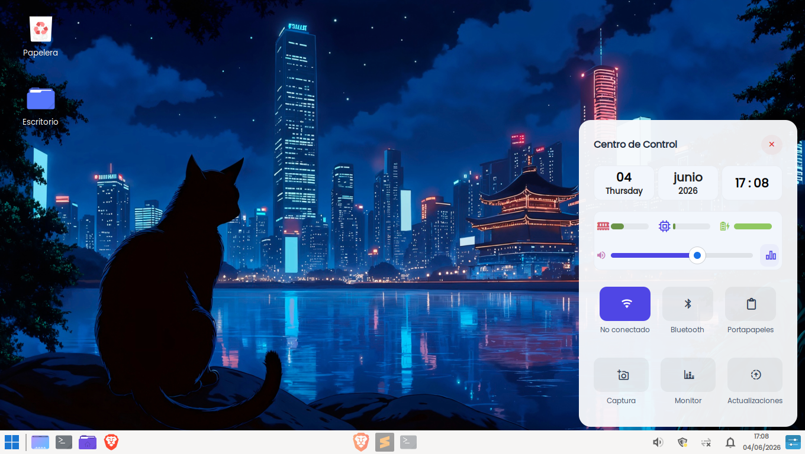

# Centro de Control Personalizado con Eww (Widgets del Sistema) (Tema Light)
Este repositorio contiene la configuración completa de un Centro de Control (Control Center) flotante, minimalista y responsivo desarrollado con Eww (Elkowars Wacky Widgets) sobre el entorno de escritorio XFCE en Linux Mint.
El panel incluye selectores rápidos (quick toggles), monitores de rendimiento en tiempo real, barras de control deslizantes y accesos directos automatizados a herramientas del sistema.

## Demostración Visual
Versión 1.0 — Tema Light Completo
Aquí se muestra el diseño original con paleta clara, esquinas redondeadas pronunciadas y toggles dinámicos.

## Recursos, Fuentes e Iconografía
Para el correcto renderizado gráfico y visual del panel, se instalaron y configuraron los siguientes recursos iconográficos:

### Tipografía del Sistema / Iconos: 
JetBrainsMono Nerd Font (Proporciona soporte completo para los glifos geométricos de la interfaz).

### Iconos Utilizados (Nerd Fonts):
- 󰖩 Wi-Fi Activo / Estado de Red
- 󰂯 Bluetooth
- 󱊦 Estado de la Batería
- " Monitor de CPU y Memoria RAM
- 󰕾 Volumen / 󰺣 Ecualizador
-  Historial del Portapapeles
- 󰻜" Captura de pantalla
- 󰝪 Gestor de tareas
- 󰦘 Centro de Actualizaciones del Sistema

## Dependencias y Componentes del Sistema
El panel no utiliza interfaces simuladas; interactúa directamente con los binarios y controladores nativos de Linux Mint a través de comandos ejecutados en segundo plano (&):
* Audio y Sonido: pavucontrol (Mezclador de volumen gráfico PulseAudio).
* Gestión de Redes: nm-connection-editor (Editor de conexiones de NetworkManager).
* Gestión de Dispositivos Inalámbricos: blueman-manager (Gestor de Bluetooth).
* Gestor de Actualizaciones: mintupdate (Herramienta oficial de actualización de Linux Mint).
* Gestor del Portapapeles: xfce4-clipman-plugin (Utilizado para mantener y desplegar el historial de copiado).

## Comandos de Configuración en la Terminal
A continuación, se detallan todos los comandos que se ejecutaron en la terminal para instalar dependencias, levantar servicios internos y asegurar el correcto funcionamiento del entorno gráfico.

### 1. Instalación de Herramientas del Sistema y Portapapeles
Para resolver el error de binarios faltantes (not found) y dotar al panel de un gestor de portapapeles nativo, se ejecutó: 
`sudo apt update && sudo apt install xfce4-clipman-plugin xinput xdotool -y`

### 2. Activación y Autoarranque del Portapapeles
Para inicializar el motor de copiado en segundo plano de manera inmediata: 
`xfce4-clipman &` 
Nota: Para asegurar que se ejecute solo al iniciar la computadora, se añadió el comando xfce4-clipman dentro de la herramienta gráfica "Sesión e Inicio" -> "Autoarranque de aplicaciones" de Linux Mint.

En caso de no abrir el portapapeles o mostrar dialogos, como ya se está ejecutando o no está activo puede modificar el onclic en el archivo .yuck: 
`:onclick "pgrep -x xfce4-clipman > /dev/null || xfce4-clipman & sleep 0.1 && xfce4-clipman-history &"` 
Y ejecutar en la terminal: 
`xfconf-query -c xfce4-panel -p /plugins/clipman/tweaks/inhibit-when-empty -s false 2>/dev/null || true
xfconf-query -c xfce4-panel -p /plugins/clipman/settings/save-on-quit -s true 2>/dev/null || true
xfconf-query -c xfce4-panel -p /plugins/clipman/settings/max-texts-in-history -s 10 2>/dev/null || true` 
Y reinicia el servicio para aplicar los cambios: 
`pkill xfce4-clipman && xfce4-clipman &`

### 3. Comando del Lanzador Inteligente (Toggle)
Para prescindir de botones de cierre internos (X), se configuró el botón disparador de la barra de tareas con el comando nativo de alternancia de Eww: 
`eww open --toggle centro-control`

## Arquitectura de Código y Lógica Scripting
El proyecto está estructurado de manera modular dentro de ~/.config/eww/ dividiéndose de la siguiente manera:

### 1. Scripting en Bash (scripts/getnetwork)
Este script se ejecuta en intervalos de 2 segundos mediante un defpoll en Eww. Filtra las interfaces virtuales para obtener exclusivamente el nombre real de la red activa: 
`#!/bin/bash
REDO_NAME=$(nmcli -t -f ACTIVE,NAME,DEVICE connection show | grep "^yes:" | grep -v ":lo$" | cut -d ":" -f2 | head -n 1)
if [ -z "$REDO_NAME" ]; then
    echo "No conectado"
else
    echo "$REDO_NAME" | cut -c1-15
fi`

### 2. Monitoreo de Hardware Dinámico (eww.yuck)
Se implementaron bloques condicionales ternarios para alterar las clases CSS del componente en tiempo real según el estado del hardware: 
`(defpoll wifi-status :interval "2s" "nmcli radio wifi")
(button :class "${wifi-status == 'enabled' ? 'btn-toggle active' : 'btn-toggle'}" 
        :onclick "nm-connection-editor &"`

### 3. Estilos Centralizados en CSS/GTK (eww.scss)
Toda la presentación visual se extrajo de las etiquetas inline hacia clases globales reutilizables, manejando transparencias complejas (rgba) y transiciones de estado fluidas

### 4. Permisos de Ejecución para los Scripts
Por seguridad, Linux Mint bloquea la ejecución de archivos de texto .sh o binarios recién creados. Para permitir que Eww lea e invoque correctamente la lógica interna de la carpeta scripts/, es estrictamente necesario otorgarles permisos de ejecución mediante el comando chmod +x.
Ejecuta el siguiente comando en tu terminal para aplicar el permiso a todos los scripts existentes de forma simultánea:

`chmod +x ~/.config/eww/scripts/*`

Nota: Si en el futuro creas un nuevo script dentro de esa carpeta (por ejemplo, para la versión 2), recuerda que siempre debes correr chmod +x apuntando a ese nuevo archivo para que Eww pueda ejecutarlo sin restricciones.

## Gestión de Variantes del Proyecto (Git & GitHub)
Este repositorio utiliza una estructura profesional de ramas (branches) para almacenar y alternar entre distintas propuestas estéticas del panel:

- Rama main: Contiene la Versión 1.0, caracterizada por el tema visual Light estable.